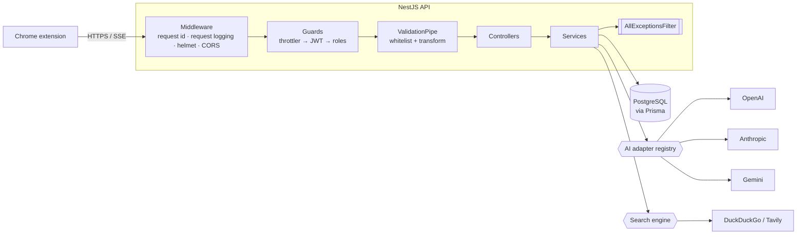
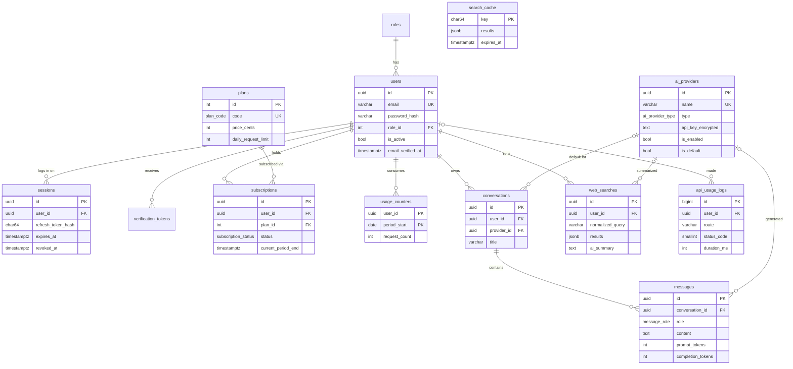

# EchoGPT Backend

[](https://github.com/Rayhan-002/echo-gpt/actions/workflows/ci.yml)

Production-ready REST API for the [EchoGPT multi-AI chat Chrome extension](https://chromewebstore.google.com/detail/echogpt-multi-ai-chat-sid/negimdcamohmoheiifgecbjgjepkcfhj).
Users chat with **OpenAI, Claude (Anthropic) and Google Gemini** from one API, run AI-assisted web searches, and are metered by Free / Premium plans. Administrators manage users, plans, AI providers and observe usage.

**Stack:** NestJS 11 · TypeScript (strict) · PostgreSQL · Prisma · JWT · Swagger / OpenAPI 3 · Jest · Docker · GitHub Actions

---

## Contents

- [Highlights](#highlights)
- [Quick start](#quick-start)
- [API overview](#api-overview)
- [Architecture](#architecture)
- [Database design](#database-design)
- [Security](#security)
- [Scalability & design decisions](#scalability--design-decisions)
- [Testing](#testing)
- [Configuration](#configuration)
- [Scripts](#scripts)
- [Project structure](#project-structure)
- [Future work](#future-work)

---

## Highlights

| Area | What is implemented |
| --- | --- |
| **Auth** | Register, login, logout (current / all devices), short-lived JWT access tokens, **rotating opaque refresh tokens with reuse detection**, Argon2id password hashing, email verification, forgot / reset password, per-device session list & revoke |
| **Users** | Profile, update profile, change password (signs out other devices), delete account (cascades), roles `ADMIN` / `USER` |
| **Subscriptions** | Free & Premium plans, status, upgrade / downgrade with history, **daily quotas enforced atomically** in PostgreSQL, remaining-requests API, lazy expiry of paid periods |
| **AI providers** | OpenAI, Anthropic, Gemini behind one adapter interface; add / edit / delete / enable / disable; **API keys encrypted with AES-256-GCM**; single default provider enforced by the DB; live health checks |
| **Chat** | Send prompt, receive response, per-request provider & model selection, conversation history with search & pagination, **SSE streaming** for all three vendors |
| **Web search** | AI-assisted search with cited summaries, history, recent searches, suggestions, **shared result cache** |
| **Admin** | Dashboard stats, user / subscription / plan / provider management, usage analytics (time series, per provider, per endpoint with p95), request logs, system health, scheduled maintenance |
| **Docs** | Every endpoint documented in Swagger (params, bodies, examples, errors, auth), exported [`docs/openapi.json`](docs/openapi.json) and a [Postman collection](docs/postman/EchoGPT.postman_collection.json) |
| **Quality** | Strict TypeScript, ESLint + Prettier, 39 unit tests, 13 e2e tests on real PostgreSQL, CI pipeline, multi-stage Docker image |

---

## Quick start

### Prerequisites

- Node.js **20.11+** (22 LTS recommended) and npm
- PostgreSQL **14+** (or Docker, see below)

### Run locally

```bash
git clone https://github.com/Rayhan-002/echo-gpt.git
cd echo-gpt
npm ci                      # also generates the Prisma client

cp .env.example .env
# Edit .env:
#   DATABASE_URL       -> your PostgreSQL connection string (URL-encode special chars, e.g. @ -> %40)
#   JWT_ACCESS_SECRET  -> node -e "console.log(require('crypto').randomBytes(48).toString('base64'))"
#   ENCRYPTION_KEY     -> node -e "console.log(require('crypto').randomBytes(32).toString('base64'))"

npm run db:migrate:deploy   # apply migrations (npm run db:migrate while developing)
npm run db:seed             # roles, plans, admin user (+ optional providers)
npm run start:dev
```

- API: <http://localhost:3000/api/v1>
- Swagger UI: <http://localhost:3000/docs> (raw spec: `/docs/openapi.json`)
- Health: <http://localhost:3000/api/health>

The seed creates an administrator: **`admin@echogpt.local` / `Admin@12345`** (override with `SEED_ADMIN_EMAIL` / `SEED_ADMIN_PASSWORD`, and change it outside local development).

### Add AI providers

Chat needs at least one provider. Either set `SEED_OPENAI_API_KEY`, `SEED_ANTHROPIC_API_KEY` and/or `SEED_GEMINI_API_KEY` before seeding, or register one through the admin API:

```bash
curl -X POST http://localhost:3000/api/v1/admin/providers \
  -H "Authorization: Bearer <admin access token>" -H "Content-Type: application/json" \
  -d '{ "name": "OpenAI", "type": "OPENAI", "apiKey": "sk-...", "isDefault": true }'
```

Vendor defaults (base URL, model list, default model) are applied automatically and can be overridden per provider. `baseUrl` also lets you point a provider at a proxy or an OpenAI-compatible gateway.

### Run with Docker

```bash
cp .env.example .env        # set JWT_ACCESS_SECRET and ENCRYPTION_KEY as above
docker compose up --build
```

Compose starts PostgreSQL (host port **5433**), runs a one-off `migrate` job (migrations + seed), then starts the API on port 3000.

### Try it

```bash
# Register (returns accessToken + refreshToken)
curl -X POST localhost:3000/api/v1/auth/register -H "Content-Type: application/json" \
  -d '{"email":"jane@example.com","password":"Str0ngPass!","fullName":"Jane"}'

# Ask a question (starts a new conversation on the default provider)
curl -X POST localhost:3000/api/v1/chat/messages -H "Authorization: Bearer $TOKEN" \
  -H "Content-Type: application/json" -d '{"content":"Explain JWT refresh token rotation"}'

# Stream the answer (Server-Sent Events)
curl -N -X POST localhost:3000/api/v1/chat/messages/stream -H "Authorization: Bearer $TOKEN" \
  -H "Content-Type: application/json" -d '{"content":"Write a haiku about PostgreSQL"}'
#  event: start  data: {"conversationId":"…","providerId":"…","model":"gpt-5-mini"}
#  event: delta  data: {"text":"Rows "}
#  ...
#  event: done   data: {"conversation":{…},"userMessage":{…},"assistantMessage":{…}}

# AI-assisted web search with a cited summary
curl -X POST localhost:3000/api/v1/search -H "Authorization: Bearer $TOKEN" \
  -H "Content-Type: application/json" -d '{"query":"What is NestJS?","summarize":true}'
```

Import [`docs/postman/EchoGPT.postman_collection.json`](docs/postman/EchoGPT.postman_collection.json) into Postman. Login / register / refresh store the tokens in collection variables automatically.

---

## API overview

All endpoints are versioned under `/api/v1` (health probes are version-neutral under `/api/health`). The complete reference, with schemas, examples and error responses, is in Swagger.

| Group | Endpoints |
| --- | --- |
| **Auth** | `POST /auth/register` · `POST /auth/login` · `POST /auth/refresh` · `POST /auth/logout` · `POST /auth/logout-all` · `POST\|GET /auth/verify-email` · `POST /auth/resend-verification` · `POST /auth/forgot-password` · `POST /auth/reset-password` · `GET /auth/sessions` · `DELETE /auth/sessions/:id` |
| **Users** | `GET /users/me` · `PATCH /users/me` · `PATCH /users/me/password` · `DELETE /users/me` |
| **Subscriptions** | `GET /subscriptions/plans` · `GET /subscriptions/me` · `PATCH /subscriptions/me` · `GET /subscriptions/me/usage` · `GET /subscriptions/me/history` |
| **Providers** | `GET /providers` (enabled providers & models for the extension's picker) |
| **Chat** | `POST /chat/messages` · `POST /chat/messages/stream` · `GET\|POST /chat/conversations` · `GET\|PATCH\|DELETE /chat/conversations/:id` · `GET /chat/conversations/:id/messages` |
| **Search** | `POST /search` · `GET\|DELETE /search/history` · `GET\|DELETE /search/history/:id` · `GET /search/recent` · `GET /search/suggestions` |
| **Admin: Dashboard** | `GET /admin/dashboard` |
| **Admin: Users** | `GET /admin/users` · `GET\|PATCH\|DELETE /admin/users/:id` · `POST /admin/users/:id/revoke-sessions` |
| **Admin: Subscriptions** | `GET /admin/subscriptions` · `GET /admin/subscriptions/plans` · `PATCH /admin/subscriptions/plans/:code` · `PUT /admin/subscriptions/users/:userId` |
| **Admin: AI Providers** | `GET\|POST /admin/providers` · `GET\|PATCH\|DELETE /admin/providers/:id` · `POST /admin/providers/:id/{enable,disable,default,health-check}` · `POST /admin/providers/health-check` |
| **Admin: Analytics & Logs** | `GET /admin/analytics/usage` · `GET /admin/analytics/providers` · `GET /admin/analytics/endpoints` · `GET /admin/logs` |
| **Admin: System** | `GET /admin/system/health` · `POST /admin/system/maintenance` |
| **Health** | `GET /api/health/live` · `GET /api/health` |

### Conventions

- **Authentication**: every route requires `Authorization: Bearer <accessToken>` unless marked public in Swagger.
- **Errors** use one envelope everywhere; the `x-request-id` header matches `requestId`:
  ```json
  { "statusCode": 400, "error": "Bad Request", "message": "Validation failed",
    "details": ["email must be an email"], "path": "/api/v1/auth/register",
    "timestamp": "2026-09-29T10:15:30.000Z", "requestId": "6f1c2c1e-…" }
  ```
- **Pagination**: `?page=1&limit=20` (max 100) → `{ "data": [...], "meta": { "page", "limit", "total", "totalPages" } }`.
- **Status codes**: `201` create, `204` delete / logout, `400` validation, `401` authentication, `403` role, `404` missing or not owned, `409` conflict, `429` rate limit **or plan quota**, `502` upstream AI / search failure, `503` no provider configured.

---

## Architecture



**Modules** (one per bounded context, under `src/modules`): `auth`, `sessions`, `users`, `subscriptions`, `ai-providers`, `chat`, `search`, `admin`, `request-logs`, `mail`, `health`. Cross-cutting concerns live in `src/common` (decorators, DTOs, exception filter, security services, upstream HTTP helpers).

**Request pipeline**

1. `RequestIdMiddleware` assigns or propagates `x-request-id` for log correlation.
2. `RequestLoggingMiddleware` records every request once the response closes, **including requests rejected by guards** (interceptors never see those).
3. Global guards run in order: rate limit → JWT (routes are private by default, `@Public()` opts out) → `@Roles()`.
4. `ValidationPipe` strips and rejects unknown fields (mass-assignment protection) and transforms DTOs.
5. `AllExceptionsFilter` maps every error (HTTP, Prisma, unknown) to the error envelope. Internals never leak.

**AI provider abstraction.** `AiProviderAdapter` (`complete`, `stream`, `healthCheck`) is implemented once per vendor and resolved by an `AiAdapterRegistry` (strategy pattern). Adapters call the vendor REST APIs with native `fetch`, which avoids three SDKs and their version drift, and share an SSE parser, timeouts, cancellation and error normalization. Adding a vendor means one adapter class, one enum value and one catalog entry.

**Chat flow.** `prepare()` validates ownership, resolves provider/model (request → conversation → default) and reserves quota. It runs *before* any streaming headers are sent, so validation, quota and provider errors are plain JSON even on the SSE endpoint. The turn is persisted in one transaction **only after the provider answered**, so a failure leaves no half-written conversation and the quota is refunded. If a stream is interrupted by the client after text was generated, the partial answer is saved (the vendor billed it).

---

## Database design

PostgreSQL, 13 tables, normalized to 3NF. Migrations are in [`prisma/migrations`](prisma/migrations); the schema is in [`prisma/schema.prisma`](prisma/schema.prisma).



Design notes:

- **Integrity lives in the database, not only in code.** The initial migration adds constraints Prisma cannot express: a partial unique index for **one `ACTIVE` subscription per user**, a partial unique index for **a single default AI provider**, `CHECK` that the default provider is enabled, lower-case emails, and non-negative prices and counters.
- **Subscriptions are history**, not a mutable row: plan changes cancel the current subscription and insert a new one.
- **Quotas** use a `(user_id, period_start)` counter row incremented by one guarded statement (`INSERT … ON CONFLICT … DO UPDATE … WHERE request_count < limit`), so concurrent requests can never exceed the plan limit. An e2e test fires `limit + 5` concurrent chat requests and asserts exactly `limit` succeed.
- **Deletion semantics**: deleting a user cascades to their sessions, tokens, subscriptions, chats and searches. Request logs are kept with `user_id` set to `NULL` for analytics. Deleting a provider keeps chat history (`SET NULL`).
- **Types**: UUID keys for entities, serial ints for small reference tables, `bigint` for the high-volume log table, `timestamptz` everywhere, native enums, `jsonb` for search result snapshots.
- **Indexes** follow the access paths: `(user_id, updated_at DESC)` for conversation lists, `(conversation_id, created_at)` for messages, `(created_at)`, `(route, created_at)`, `(status_code, created_at)` for analytics, and so on.

---

## Security

- **Passwords**: Argon2id. Login runs a dummy verification for unknown emails so response times don't reveal which accounts exist; forgot-password always returns 202.
- **Access tokens**: HS256 JWTs (default 15 min) carrying user id and **session id**. The JWT strategy checks the session and the account on every request, so **logout, session revocation, password reset and deactivation take effect immediately**, and role changes apply without re-login.
- **Refresh tokens**: opaque `<sessionId>.<secret>`, only a SHA-256 hash is stored. They rotate on every use via compare-and-swap; **presenting an already-rotated token revokes the whole session** (OAuth 2.0 Security BCP reuse detection).
- **Verification / reset tokens**: random, hashed, single-use (atomic consume), expiring. A password reset or change revokes other sessions.
- **Provider API keys**: AES-256-GCM with a random IV per encryption (authenticated, tamper-evident). Keys are never returned, only masked (`••••••••abcd`), and are sent to vendors in headers, never in URLs.
- **Authorization**: deny-by-default global JWT guard plus role guard. Every user-owned query is scoped by `userId`, so other users' resources return 404 rather than 403, which avoids leaking that they exist. Admins cannot demote, deactivate or delete themselves, and the last active admin cannot be removed.
- **Input handling**: whitelisted DTOs (`forbidNonWhitelisted`), strict validation, `ParseUUIDPipe`, parameterized SQL only.
- **Transport & abuse**: Helmet security headers, configurable CORS allow-list (for `chrome-extension://<id>` origins), global rate limit plus stricter limits on credential endpoints.
- **Privacy**: request logs drop query strings (they can contain tokens), and search suggestions never include other users' queries.
- **Config**: environment is validated at boot (Joi). The app refuses to start with weak or missing secrets.

---

## Scalability & design decisions

- **Stateless API**: no in-process session state. Sessions, quotas and the search cache live in PostgreSQL, so instances scale horizontally behind a load balancer.
- **Race-free counters and defaults** via single SQL statements and partial unique indexes rather than read-then-write logic.
- **Request logging off the hot path**: logs are buffered and batch-inserted (`createMany`) every 2 s or 200 entries, flushed on graceful shutdown, and capped in memory if the DB is down.
- **Streaming** uses SSE over `POST` with incremental writes, proxy-buffering disabled (`X-Accel-Buffering: no`), and upstream cancellation when the client disconnects.
- **Bounded work**: the model context is capped (last 30 messages), analytics ranges are limited to 366 days, pagination is capped at 100 items, and upstream calls have timeouts.
- **Maintenance**: a daily job purges expired sessions and tokens, the expired search cache and logs older than `API_LOG_RETENTION_DAYS`. Provider health refreshes every 30 minutes.
- **Payments are out of scope**: plan changes apply directly. In production, upgrades would be confirmed by a payment provider webhook (for example Stripe) calling the same `SubscriptionsService.changePlan`.

Next steps at higher scale: Redis for the throttler and search cache, a queue for request logs, time-partitioning `api_usage_logs`, and a distributed lock (or a single worker) for scheduled jobs.

---

## Testing

```bash
npm test               # 39 unit tests (services, guards, crypto, SSE parser, engines)
npm run test:cov       # with coverage
npm run test:e2e       # 13 end-to-end tests: needs a migrated + seeded database
```

The e2e suite boots the real application against PostgreSQL and an in-process **OpenAI-compatible mock server**, so auth, RBAC, provider registration and health, chat and **SSE streaming** are exercised end to end without real API keys. CI runs lint, format check, typecheck, unit tests with coverage, build, e2e tests against a PostgreSQL service container, and a Docker image build.

---

## Configuration

All variables are documented in [`.env.example`](.env.example) and validated at startup.

| Variable | Default | Description |
| --- | --- | --- |
| `DATABASE_URL` | – | PostgreSQL connection string (**required**) |
| `JWT_ACCESS_SECRET` | – | ≥ 32 chars (**required**) |
| `ENCRYPTION_KEY` | – | 32 random bytes, base64, encrypts provider keys (**required**) |
| `PORT` / `API_PREFIX` | `3000` / `api` | HTTP port and route prefix |
| `APP_URL` | `http://localhost:3000` | Public URL used in email links |
| `CORS_ORIGINS` | *(empty)* | Comma-separated allow-list, e.g. `chrome-extension://<id>` |
| `JWT_ACCESS_TTL_SECONDS` | `900` | Access token lifetime |
| `REFRESH_TOKEN_TTL_DAYS` | `30` | Sliding refresh token lifetime |
| `THROTTLE_TTL_SECONDS` / `THROTTLE_LIMIT` | `60` / `120` | Global rate limit per client |
| `SMTP_*`, `MAIL_FROM` | *(empty)* | SMTP settings; without `SMTP_HOST` emails are logged |
| `AI_REQUEST_TIMEOUT_MS` | `60000` | Timeout for the vendor to start responding |
| `SEARCH_ENGINE` | `duckduckgo` | `duckduckgo` (no key) or `tavily` (needs `TAVILY_API_KEY`) |
| `SEARCH_CACHE_TTL_SECONDS` | `3600` | Search result cache TTL (`0` disables) |
| `API_LOG_RETENTION_DAYS` | `90` | Request log retention |
| `SWAGGER_ENABLED` / `LOG_JSON` | `true` / `false` | Docs toggle and structured JSON logs |
| `SEED_ADMIN_*`, `SEED_*_API_KEY` | – | Seed admin credentials and optional providers |

---

## Scripts

| Script | Purpose |
| --- | --- |
| `npm run start:dev` | Watch mode |
| `npm run build` / `npm run start:prod` | Compile / run compiled output |
| `npm run db:migrate` | Create and apply a migration (development) |
| `npm run db:migrate:deploy` | Apply pending migrations (CI / production) |
| `npm run db:seed` / `npm run db:reset` | Seed reference data / reset database |
| `npm run lint` / `npm run format` / `npm run typecheck` | Code quality |
| `npm test` / `npm run test:e2e` | Unit / end-to-end tests |
| `npm run docs:generate` | Regenerate `docs/openapi.json` and the Postman collection |

---

## Project structure

```
src/
├── main.ts / app.module.ts / app.setup.ts   # bootstrap, root module, shared HTTP pipeline
├── swagger.ts                               # OpenAPI document & Swagger UI
├── config/                                  # typed config + Joi env validation
├── prisma/                                  # PrismaService (global)
├── common/
│   ├── decorators/                          # @Public, @Roles, @AdminOnly, @CurrentUser, Swagger helpers
│   ├── dto/                                 # error envelope, pagination, message DTOs
│   ├── filters/                             # AllExceptionsFilter
│   ├── http/                                # upstream fetch + SSE parser
│   ├── middleware/                          # request id
│   ├── security/                            # PasswordService (Argon2id), EncryptionService (AES-GCM)
│   └── utils/                               # crypto helpers
├── modules/
│   ├── auth/            # register/login/refresh/logout, email verification, password reset, JWT strategy, guards
│   ├── sessions/        # refresh token rotation & reuse detection, device sessions
│   ├── users/           # profile, password, account deletion
│   ├── subscriptions/   # plans, subscriptions, QuotaService
│   ├── ai-providers/    # vendor adapters, registry, provider management
│   ├── chat/            # conversations, send / stream
│   ├── search/          # engines, cache, history, suggestions
│   ├── admin/           # dashboard, users, subscriptions, analytics, logs, system
│   ├── request-logs/    # buffered request logging middleware
│   ├── mail/            # SMTP / log mailer
│   └── health/          # liveness & readiness probes
└── scripts/export-openapi.ts
prisma/      # schema, migrations, seed
test/        # e2e tests + mock OpenAI server
docs/        # openapi.json, Postman collection
```

Git history follows [Conventional Commits](https://www.conventionalcommits.org/) and is organized by milestone (scaffold → database → auth → subscriptions → providers → chat → search → admin → delivery). Work happens on `dev` and is merged into `main`.

---

## Future work

- Payment integration (Stripe checkout + webhooks) gating plan upgrades
- OAuth sign-in (Google) for the extension
- Redis-backed throttling and cache, and a queue for logs and emails
- Per-plan model access rules and token-based (rather than request-based) quotas
- Conversation export and sharing; attachments / page context from the extension
